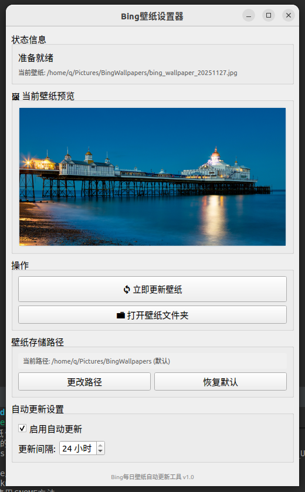

<div align="center">

# 🖼️ Bing 壁纸设置器

[](https://opensource.org/licenses/MIT)
[](https://www.linux.org/)
[](https://www.qt.io/)
[](https://isocpp.org/)

**自动获取 Bing 每日精美 4K 壁纸并设置为桌面背景的现代化 Linux 应用**

[功能特点](#-功能特点) • [快速开始](#-快速开始) • [编译构建](#-编译构建) • [使用说明](#-使用说明) • [贡献指南](#-贡献指南)

</div>

---

## ✨ 功能特点

- 🎨 **现代化界面** - 简洁优雅的 Qt GUI 界面，支持深浅主题自动适配
- 🖼️ **实时预览** - 主界面直接显示当前壁纸，无需额外点击
- 📷 **4K 超高清** - 自动获取 Bing 每日 4K 超高清壁纸 (3840x2160)
- 📁 **自定义路径** - 灵活配置壁纸存储位置
- ⏰ **智能定时** - 自动更新间隔可调（1-24 小时）
- 🔔 **系统托盘** - 最小化到托盘，后台静默运行
- 🧹 **自动清理** - 智能管理磁盘空间，保留最近 7 天壁纸
- 🖥️ **多桌面支持** - 完美支持 GNOME、KDE 等主流桌面环境
- 🌓 **主题同步** - 同时设置明暗主题壁纸
- 🎯 **开箱即用** - 提供 DEB 安装包和便携版，安装简单

## 📸 应用截图

<div align="center">

### 主界面



*简洁美观的主界面，壁纸预览一目了然*

### 系统托盘


*右键托盘图标即可快速操作*

### 应用菜单


*在系统应用菜单中启动*

</div>

## 🚀 快速开始

注：当前要有图片作为背景显示

### 方法一：DEB 包安装（推荐）

```bash
# 下载最新版本
wget https://github.com/xiaoff2004/bing-wallpaper-setter/releases/latest/download/bing-wallpaper-setter_1.0.0_amd64.deb

# 安装
sudo dpkg -i bing-wallpaper-setter_1.0.0_amd64.deb

# 如果遇到依赖问题，运行
sudo apt-get install -f
```

### 方法二：便携版

```bash
# 下载并解压
wget https://github.com/xiaoff2004/bing-wallpaper-setter/releases/latest/download/bing-wallpaper-setter-portable.tar.gz
tar -xzf bing-wallpaper-setter-portable.tar.gz
cd bing-wallpaper-setter

# 安装到系统
./install.sh
```

### 方法三：脚本安装

```bash
# 克隆仓库
git clone https://github.com/xiaoff2004/bing-wallpaper-setter.git
cd bing-wallpaper-setter

# 运行安装脚本
./scripts/build_and_install.sh
```

## 🛠️ 编译构建

### 系统要求

- Ubuntu 20.04+ / Debian 11+ / 其他 Linux 发行版
- GCC 9+ 或 Clang 10+
- CMake 3.16+
- Qt 5.15+
- GNOME 或 KDE 桌面环境

### 安装依赖

**Ubuntu/Debian:**

```bash
sudo apt update
sudo apt install cmake g++ qtbase5-dev qt5-qmake libqt5network5
```

编译步骤

```bash
# 克隆项目
git clone https://github.com/your-username/bing-wallpaper-setter.git
cd bing-wallpaper-setter

# 创建构建目录
mkdir build && cd build

# 配置并编译
cmake -DCMAKE_BUILD_TYPE=Release ../src
make -j$(nproc)

# 运行程序
./bin/BingWallpaperSetter
```

### 打包发布

```bash
# 生成 DEB 包和便携版
./scripts/package.sh

# 生成的文件位于 dist/ 目录
# - dist/bing-wallpaper-setter_1.0.0_amd64.deb
# - dist/bing-wallpaper-setter-portable.tar.gz
```

## 📖 使用说明

### 启动应用

- **应用程序菜单**: 搜索 "Bing壁纸设置器"
- **命令行**: 运行 `BingWallpaperSetter`
- **后台运行**: 最小化到系统托盘，程序继续在后台工作

### 主要功能

#### 🔄 立即更新壁纸

点击主界面的"立即更新壁纸"按钮：

- 从 Bing API 获取今日壁纸信息
- 下载 4K 超高清原图 (3840×2160)
- 自动设置为桌面背景
- 在主界面预览当前壁纸

#### ⚙️ 自动更新设置

1. 勾选"启用自动更新"
2. 设置更新间隔（1-24 小时）
3. 程序将在后台自动更新壁纸

#### 📁 壁纸管理

- **打开文件夹**: 快速访问保存的壁纸文件
- **更改路径**: 自定义壁纸存储位置
- **恢复默认**: 重置为默认路径 `~/Pictures/BingWallpapers`

### 配置文件

- 配置文件: `~/.config/BingWallpaper/`
- 默认壁纸路径: `~/Pictures/BingWallpapers/`
- 壁纸命名格式: `bing_wallpaper_YYYYMMDD.jpg`

## 🗑️ 卸载

### DEB 包卸载

```bash
sudo apt remove bing-wallpaper-setter
# 或
sudo dpkg -r bing-wallpaper-setter
```

### 便携版卸载

```bash
cd bing-wallpaper-setter
./uninstall.sh  # 便携版
```

### 脚本卸载

```bash
cd bing-wallpaper-setter
./scripts/uninstall.sh   # 或 ./uninstall.sh  # 便携版
```

卸载程序会：

- ✅ 停止运行中的程序
- ✅ 删除程序文件
- ✅ 删除桌面快捷方式和图标
- ✅ 删除配置文件
- ❓ 可选删除已下载的壁纸（由用户决定）

## 📁 项目结构

```
├── src/                          # 源代码
│   ├── main.cpp                  # 程序入口
│   ├── MainWindow.{h,cpp}        # 主窗口界面
│   ├── BingWallpaperSetter.{h,cpp}  # 核心功能
│   ├── CMakeLists.txt            # CMake 配置
│   ├── bing-wallpaper-setter.desktop  # 桌面快捷方式
│   └── bing-wallpaper-setter.png # 应用图标
│
├── scripts/                      # 构建脚本
│   ├── package.sh                # 打包脚本
│   ├── install.sh                # 安装脚本
│   ├── uninstall.sh              # 卸载脚本
│   └── build_and_install.sh      # 快速构建安装
│
├── build/                        # 构建目录（自动生成）
├── dist/                         # 发布文件（自动生成）
├── LICENSE                       # MIT 许可证
└── README.md                     # 项目文档

```

## 🤝 贡献指南

欢迎贡献代码、报告问题或提出建议！

### 如何贡献

1. Fork 本仓库
2. 创建特性分支 (`git checkout -b feature/AmazingFeature`)
3. 提交更改 (`git commit -m 'Add some AmazingFeature'`)
4. 推送到分支 (`git push origin feature/AmazingFeature`)
5. 开启 Pull Request

### 开发指南

- 遵循现有代码风格
- 添加适当的注释
- 测试你的更改
- 更新相关文档

### 报告问题

使用 [GitHub Issues](https://github.com/your-username/bing-wallpaper-setter/issues) 报告：

- 🐛 Bug 报告
- 💡 功能建议
- 📝 文档改进
- ❓ 使用问题

## 📄 许可证

本项目采用 MIT 许可证 - 详见 [LICENSE](LICENSE) 文件

## 🙏 致谢

- [Bing](https://www.bing.com/) - 提供精美的每日壁纸
- [Qt](https://www.qt.io/) - 强大的跨平台 GUI 框架
- 所有贡献者和用户的支持

## 📮 联系方式

- **问题反馈**: [GitHub Issues](https://github.com/your-username/bing-wallpaper-setter/issues)
- **功能建议**: [GitHub Discussions](https://github.com/your-username/bing-wallpaper-setter/discussions)

---

<div align="center">

**如果这个项目对你有帮助，请给个 ⭐️ Star 支持一下！**

Made with ❤️ by the Bing Wallpaper Setter Team

</div>
